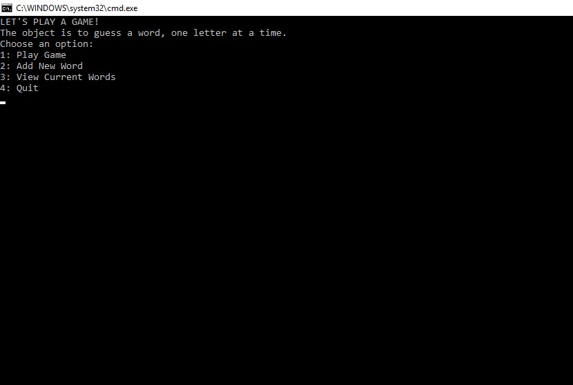

# Lab03-GuessingGame

## About this project
This program is a guessing game. Once the user starts it, they are presented with a list of options. The game begins by autopopulating a list of words. The user can view the words, add a word, or play the game.
The game begins by reading the current file and selecting a random word. The user is then asked to input a character (word or number). Each incorrect and correct guess is calculated, with corret guesses being evaluated against the random word.
When the user successfully guesses all the right letters, the game is complete and they are taken back to the main menu.

## Example

## How to use
This program requires Visual Studio. Once the repo has been cloned to the user's local machine, they simply need to open the solution using Visual Studio and run the program. Afer that, follow the prompts. The test file can be opened via the test solution also located in the project directory.

## Licensing
This program is available under the MIT license.